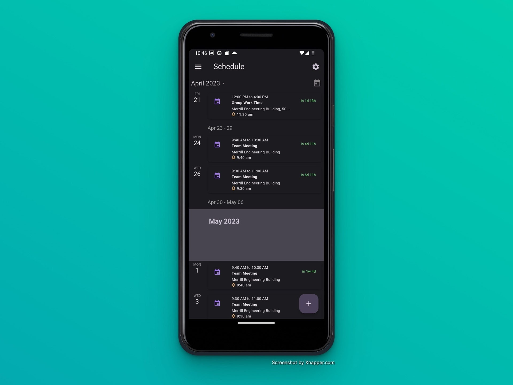

# Timely Frontend

Timely is a calendar application that predicts the optimal time to notify  a user based on their tendencies and commuting patterns. The application is cross-platform for both iOS and Android and syncs with Google and Microsoft calendars. The frontend is built using Flutter, Dart, and Firebase.

## Screenshots

## Getting Started

- Flutter
- Dart
- Firebase
- Google Cloud Platform
- Google and Apple Maps API Keys
- Apple, Google, and Microsoft Developer Accounts
  
## Capstone Team

- Adam Camp
- Alex Cespedes
- David Dursteler
- Ethan Emoto
- Nicole Sundberg